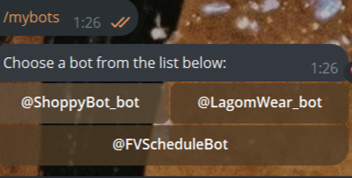
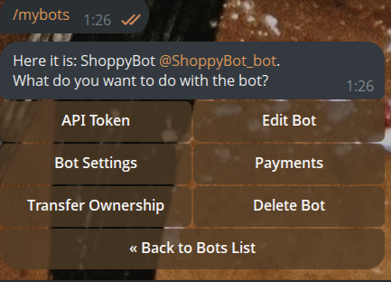
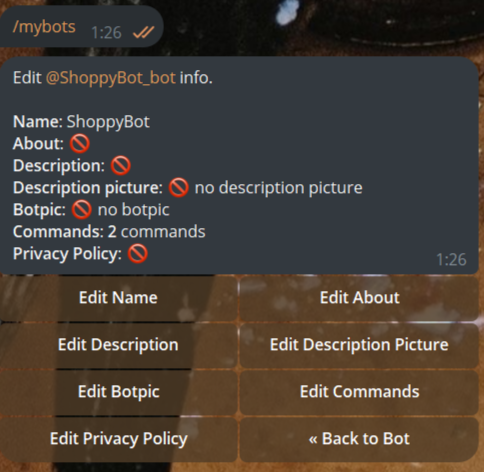
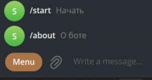
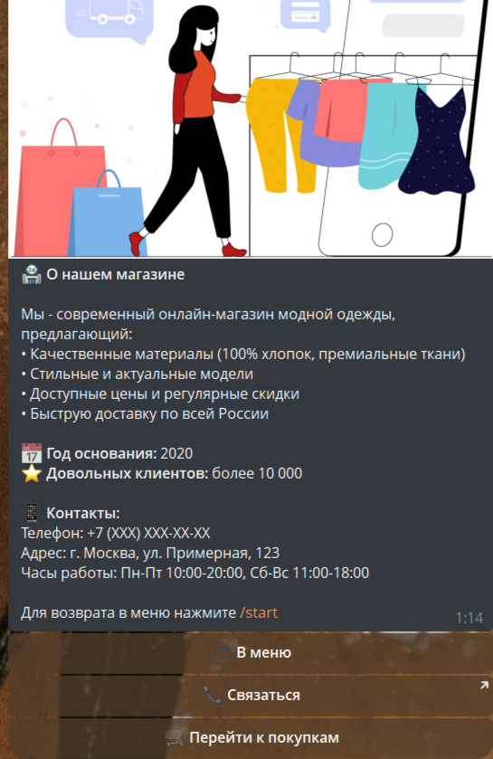

# Модификация Telegram-бота для магазина одежды
Данный документ описывает процесс модификации существующего Telegram-бота, предназначенного для приобретения одежды.
Цель доработки — расширение функциональности и улучшение пользовательского взаимодействия.

## Добавление кнопки меню в телеграмме 
Для бота в Telegram можно настроить отдельную кнопку меню с набором команд или переходом в веб-приложение.
1. Для создания меню запустите в Telegram бота `@BotFather`.
2. Впишите команду `/mybots` необходимо выбрать бота для которого хотите настроить меню.
   


4. Далее выбираем `Edit Bot`.



5. Далее — `Edit Commands`.



6. `@BotFather сообщит`, что ожидает от вас список команд. Ввести их нужно в таком формате:
- command — описание

7.Готово! Команды добавлены.



## Добавление подробной информации о боте
Реализоваем функцию, которая опишет цель бота, а также предоставит контакт специалиста тех.поддержки:
```python

@dp.message(Command("about"))
async def about_command(message: types.Message):
    about_text = """
<b>🏪 О нашем магазине</b>

Мы - современный онлайн-магазин модной одежды, предлагающий:
• Качественные материалы (100% хлопок, премиальные ткани)
• Стильные и актуальные модели
• Доступные цены и регулярные скидки
• Быструю доставку по всей России

<b>📅 Год основания:</b> 2020
<b>⭐ Довольных клиентов:</b> более 10 000

<b>📱 Контакты:</b>
Телефон: +7 (XXX) XXX-XX-XX
Адрес: г. Москва, ул. ПК, 123
Часы работы: Пн-Пт 10:00-20:00, Сб-Вс 11:00-18:00

Для возврата в меню нажмите /start"""

    keyboard = InlineKeyboardMarkup(inline_keyboard=[
        [InlineKeyboardButton(text="🔙 В меню", callback_data="main_menu")],
        [InlineKeyboardButton(text="📞 Связаться", url="https://t.me/tabo0oo")],
        [InlineKeyboardButton(text="🛒 Перейти к покупкам", callback_data="category_t-shirts")]
    ])

    await message.answer_photo(
        photo="https://avatars.dzeninfra.ru/get-zen_doc/271828/pub_666c3d5dbdac467014320755_666c426761a30954faafcb95/scale_1200",  # Замените на реальное фото магазина
        caption=about_text,
        parse_mode="HTML",
        reply_markup=keyboard
    )
```
## Основные изменения
1. Добавлены кнопки "/start" и "/about" в button menu
2. Создана функция about_command() для тех.поддержки пользователей:
    - Описание бота
    - Контакты оператора
    - Возврат к каталогу
4. Улучшен пользовательский опыт

### Результат 




