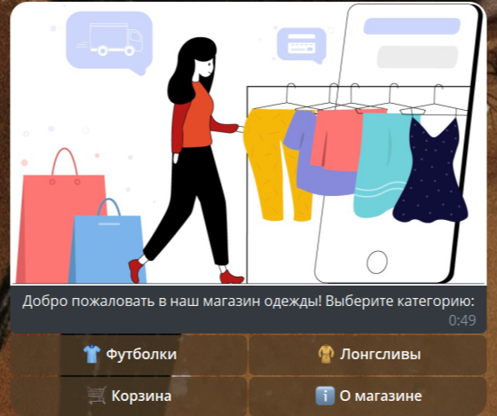
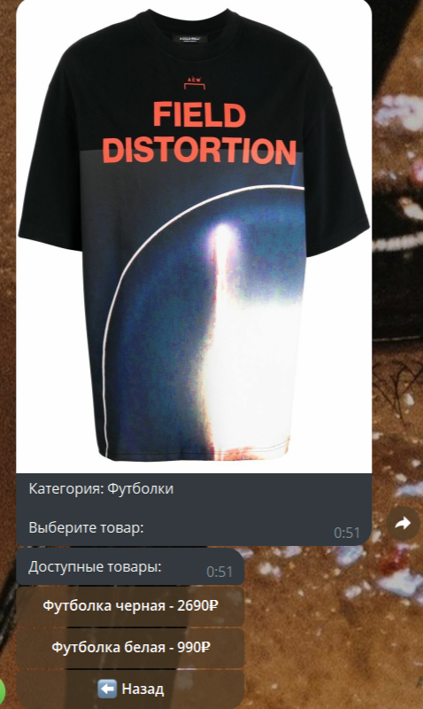
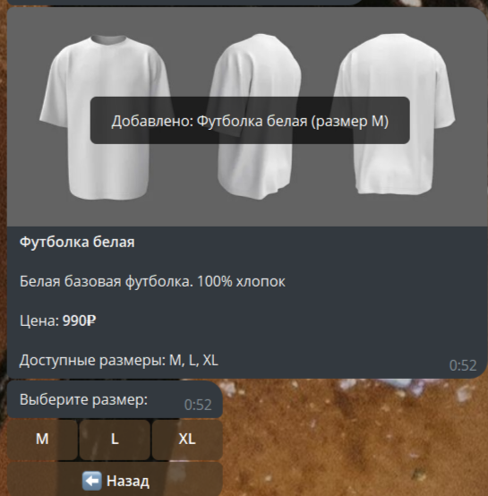
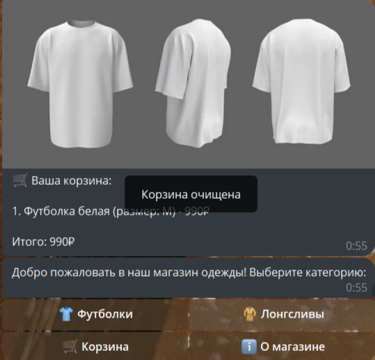

# Руководство по основной версии


Для начала работы **импортируем необходимые библиотеки**.

``` python
import logging
from aiogram import Bot, Dispatcher, types
from aiogram.types import InlineKeyboardMarkup, InlineKeyboardButton, CallbackQuery
from aiogram.filters import Command
from aiogram.utils.keyboard import InlineKeyboardBuilder
import asyncio
from aiogram.exceptions import TelegramBadRequest
from dotenv import load_dotenv
import os
```
**aiogram** - асинхронный фреймворк для создания Telegram ботов, предоставляющий:
___

``` python
# Инициализация бота
bot = Bot(token=API_TOKEN)
dp = Dispatcher()
```
- Классы `Bot` и `Dispatcher` для обработки сообщений
- Систему фильтров (`Command`, `Text` и др.)
- Инструменты для создания интерактивных клавиатур

**Функционал**

При запуске пользователем бота мы попадаем в каталог.

``` python
async def show_main_menu(chat_id: int, message_id: int = None):
    builder = InlineKeyboardBuilder()
    builder.row(
        InlineKeyboardButton(text="👕 Футболки", callback_data="category_t-shirts"),
        InlineKeyboardButton(text="🧥 Лонгсливы", callback_data="category_hoodies")
    )
    builder.row(
        InlineKeyboardButton(text="🛒 Корзина", callback_data="view_cart"),
        InlineKeyboardButton(text="ℹ️ О магазине", callback_data="about")
    )

    text = "Добро пожаловать в наш магазин одежды! Выберите категорию:"

    try:
        if message_id:
            await bot.edit_message_text(
                chat_id=chat_id,
                message_id=message_id,
                text=text,
                reply_markup=builder.as_markup()
            )
        else:
            await bot.send_photo(
                chat_id=chat_id,
                photo="https://avatars.dzeninfra.ru/get-zen_doc/271828/pub_666c3d5dbdac467014320755_666c426761a30954faafcb95/scale_1200",
                caption=text,
                reply_markup=builder.as_markup()
            )
    except TelegramBadRequest as e:
        logger.error(f"Ошибка при отображении главного меню: {e}")
        await bot.send_message(chat_id, text, reply_markup=builder.as_markup())
```


### 2. Список товаров выбранной категории

``` python
@dp.callback_query(lambda c: c.data.startswith('category_'))
async def process_category(callback_query: CallbackQuery):
    try:
        category = callback_query.data.split('_')[1]
        category_data = products.get(category)

        if not category_data:
            await callback_query.answer("Категория не найдена")
            return

        await safe_delete_message(callback_query.message.chat.id, callback_query.message.message_id)

        first_item = category_data['items'][0]
        await callback_query.message.answer_photo(
            photo=first_item['image_url'],
            caption=f"Категория: {category_data['name']}\n\nВыберите товар:"
        )

        builder = InlineKeyboardBuilder()
        for item in category_data['items']:
            builder.row(InlineKeyboardButton(
                text=f"{item['name']} - {item['price']}₽",
                callback_data=f"item_{item['id']}"
            ))
        builder.row(InlineKeyboardButton(text="⬅️ Назад", callback_data="main_menu"))

        await callback_query.message.answer(
            text="Доступные товары:",
            reply_markup=builder.as_markup()
        )

    except Exception as e:
        logger.error(f"Ошибка в process_category: {e}")
        await callback_query.answer("Произошла ошибка, попробуйте позже")
```


### 3. Корзина

После выбора размера товара можно либо оформить заказ, либо очистить корзину для нового заполнения.

#### 3.2 Очищение корзины

```python
@dp.callback_query(lambda c: c.data.startswith('add_'))
async def add_to_cart(callback_query: CallbackQuery):
    try:
        _, item_id, size = callback_query.data.split('_')
        item_id = int(item_id)

        item = None
        for category in products.values():
            for product in category['items']:
                if product['id'] == item_id:
                    item = product
                    break
            if item:
                break

        if not item:
            await callback_query.answer("Товар не найден")
            return

        user_id = callback_query.from_user.id
        if user_id not in user_carts:
            user_carts[user_id] = []

        user_carts[user_id].append({
            "id": item['id'],
            "name": item['name'],
            "price": item['price'],
            "size": size,
            "image": item['image_url']
        })

        await callback_query.answer(f"Добавлено: {item['name']} (размер {size})")

    except Exception as e:
        logger.error(f"Ошибка в add_to_cart: {e}")
        await callback_query.answer("Не удалось добавить в корзину")

```


#### 3.2 Очищение корзины

``` python
@dp.callback_query(lambda c: c.data == "clear_cart")
async def clear_cart(callback_query: CallbackQuery):
    try:
        user_id = callback_query.from_user.id
        if user_id in user_carts:
            del user_carts[user_id]
        await callback_query.answer("Корзина очищена")
        await show_main_menu(callback_query.message.chat.id, callback_query.message.message_id)
    except Exception as e:
        logger.error(f"Ошибка в clear_cart: {e}")
        await callback_query.answer("Не удалось очистить корзину")

```

